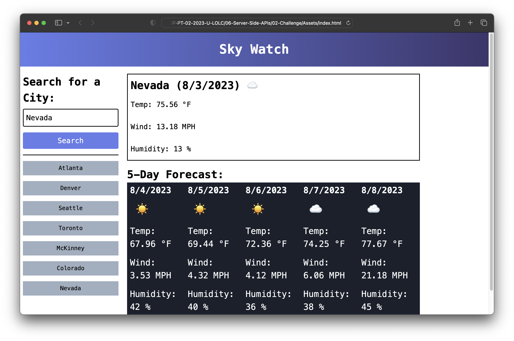

# Sky-Watch-Weather-Dashboard

## Description

Sky Watch is a web application that allows travelers to check the weather outlook for multiple cities. The motivation behind building this project was to help travelers plan their trips more effectively by providing them with up to date weather information. The application solves the problem of having to search for weather information in different locations separately. It consolidates the current and future weather conditions for a city, making it easy for users to make informed decisions about their travel plans.

## Table of Contents

- [Installation](#installation)
- [Usage](#usage)
- [Credits](#credits)
- [License](#license)

## Installation

To run the Weather Dashboard locally, follow these steps:

1. Clone the repository from GitHub.
2. Navigate to the project directory on your local machine.
3. Open the `index.html` file in your preferred web browser.

## Usage

1. When you first open the Weather Dashboard, you'll see a search form for entering the city name.
2. Type the name of the city you want to check the weather for and click on the "Search" button.
3. The application will display the current weather conditions for the entered city, including the city name, date, weather icon, temperature, humidity, and wind speed.
4. Below the current weather section, you'll find a 5 day forecast for the selected city, showing the date, weather icon, temperature, wind speed, and humidity for each day.
5. As you search for more cities, the search history will be populated with the entered cities, allowing you to click on any city in the search history to view its current and future weather conditions again.

Example screenshot:

Link to live page: https://samuel-6.github.io/Sky-Watch-Weather-Dashboard/

## Credits

This project was created by [Samuel Munguia](https://github.com/samuel-6).

## License

This project is licensed under the [MIT License](https://opensource.org/licenses/MIT). Feel free to use and modify the code as per the terms of the license.